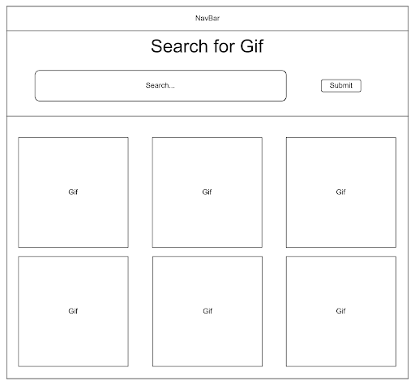
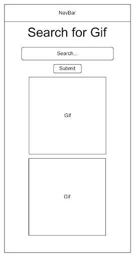

# Name: Rhett Turner

## Description:
This website acts as a giphy search engine by taking in a keyword from the user and searching through the giphy api in order to find the top 25 gifs relating to that key word. Those gifs are then displayed on screen in rows and columns.

## User Stories
* This user will click the search bar and type in the word laugh. Then several gifs relating to laughing will appear below the search bar.
* This user will click the search bar and type the word test. Then gifs relating to the word test will appear below the search bar. This user will then click the search bar. They will then type games. Then several gifs relating to games will appear below the search bar.
* This user will click the search bar and type the text “;adf/”. An error will appear prompting the user to enter a valid word into the search bar. Nothing will appear below the search bar.

## Wireframes

## Funtionality:
* Navbar with links to the homepage and to the search bar.
* Gif search feature allowing the user to input a word and then displays 25 gifs relating to the word.
* Mobile format for functionality for smaller screens.

## Technologies:
* HTML
* CSS
* JS
* JQuery/Ajax

## Future improvement:
* Add a dark mode.
* Make site look more professional by adding icons.
* add a search for trending gifs by keyword feature.
